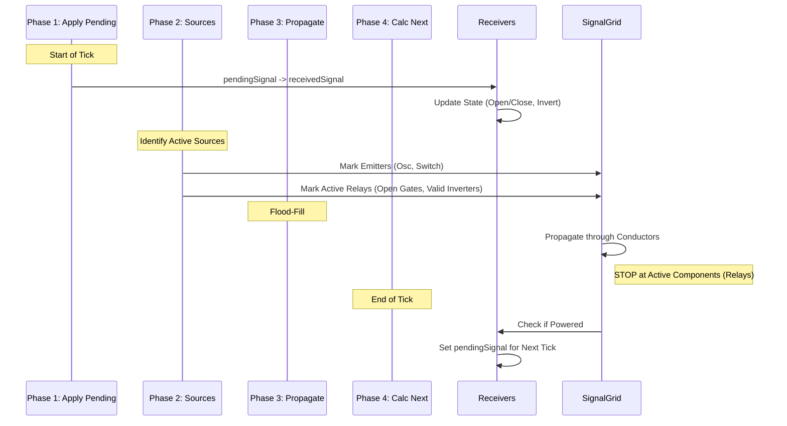

# Signal Flow Specification

## Centralized Architecture (4-Phase Loop)

### Core Concept: "A Signal is a Signal"
The system creates a `SignalGrid` each tick that essentially acts as a boolean map: `Map<EntityId, boolean>`. It tracks which entities are "Powered" at specific coordinates.
- **Value Agnostic**: The flood-fill algorithm propagates "Power".
- **Source Agnostic**: Whether the source is a Generator (Oscillator/Plate), a Relay (Gate/Inverter), or a Transceiver, the propagation is identical.

### Data Flow Per Tick

### Relay Logic (The "Stop" Rule)
Active components (Gates, Inverters) act as **Relays**.
1. They **BLOCK** instant propagation during Phase 3.
2. They **RECEIVE** power if adjacent to a powered conductor.
3. They **STORE** this state in `pendingSignal`.
4. They **ACT** and **EMIT** in the *next* tick (Phase 1 & 2).

This inherent delay creates the cascading effect and prevents infinite loops (0-tick cycles).

---

## Component Behavior Reference

| Component | Phase 2 (Source?) | Phase 3 (Conductive?) | Phase 4 (Receiver?) |
|-----------|-------------------|-----------------------|---------------------|
| **Conductor** | No | **YES** | No |
| **Oscillator** | **YES** (if period=ON) | Yes (Implicit) | No |
| **Switch** | **YES** (if pressed) | Yes (Implicit) | No |
| **Gate** | **YES** (if received=TRUE) | **NO** (Blocks) | **YES** |
| **Inverter** | **YES** (if received=FALSE) | **NO** (Blocks) | **YES** |
| **Transceiver** | **YES** (if channel active) | **NO** (Blocks) | **YES** |

