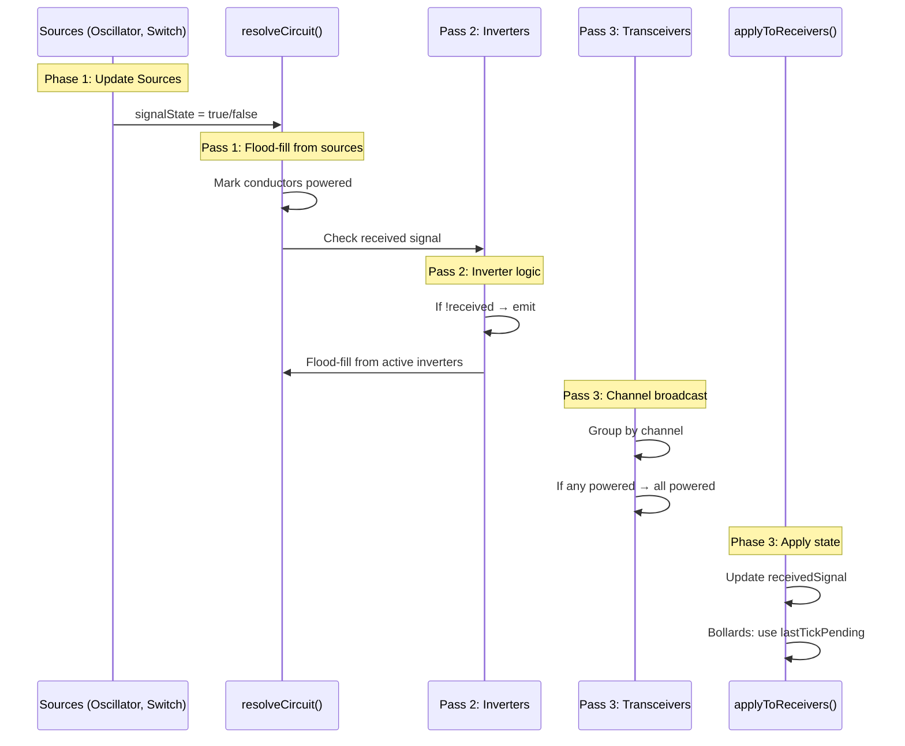

# Signal Flow Specification

## Current Architecture

### Data Flow Per Tick



### State Tracking (Current)

| State | Type | Purpose | Problem |
|-------|------|---------|---------|
| `currentTickSignals` | `Set<entityId>` | Entities with signal this tick | Conflates "receiving" vs "emitting" |
| `pendingNextTick` | `Set<entityId>` | Bollards waiting to act | Works correctly |
| `lastTickPending` | `Set<entityId>` | Bollards ready to act | Works correctly |
| `channelStates` | `Map<channel, bool>` | Transceiver channel power | Works correctly |
| `inputLatches` | `Map<entityId, dir>` | Inverter back-feed prevention | Works correctly |

---

## Proposed Refactor: Signal Objects

### Core Idea

Replace `currentTickSignals: Set<entityId>` with `Signal` objects that track origin:

```typescript
interface Signal {
  originTick: number;       // When signal was created
  sourceId: number;         // Entity that emitted
  power: boolean;           // ON/OFF
  channel?: string;         // For transceivers
}

// Per-cell signal state
cellSignals: Map<string, Signal[]>  // key = "x:y"
```

### Benefits

1. **Natural garbage collection** - Signals with old `originTick` auto-expire
2. **Clear receiving vs emitting** - Source knows it emitted, receivers check `cellSignals`
3. **Tick-delay built-in** - Receivers compare `originTick` to current tick
4. **Cascade tracking** - Signal lineage for debugging

### Migration Steps

1. [ ] Create `Signal` interface in `signal.trait.ts`
2. [ ] Replace `currentTickSignals` with `cellSignals: Map<string, Signal[]>`
3. [ ] Modify `floodFill` to create/propagate `Signal` objects
4. [ ] Update `resolveCircuit` passes to use signals
5. [ ] Update `applyToReceivers` to check signal origin
6. [ ] Remove special-case handling for inverters in `applyToReceivers`
7. [ ] Add tests for signal lineage

---

## Additional Refactor Tasks

### Transceiver Signal Flow

Current: Transceivers add themselves to `pendingNextTick` and flood-fill immediately.

Proposed: Transceivers broadcast `Signal` objects with `channel` property. Remote transceivers receive on next tick naturally.

### Bollard Tick-Delay

Current: Uses separate `pendingNextTick`/`lastTickPending` sets.

Proposed: Bollards check `Signal.originTick` vs current tick. If signal is from previous tick, act.

### Conductor Visual State

Current: Conductors check `currentTickSignals.has(id)`.

Proposed: Conductors check if any `Signal` exists at their cell.

---

## Phase 2: Future Features

These build on the signal refactor:

### Sleep/Wake Zones
- [ ] Add `SleepZoneData` entity type
- [ ] Signal receiver that toggles NPC active state
- [ ] Integrate with region-based updates

### NPC Paths as Conductors  
- [ ] Add `HasConductive` trait to path nodes
- [ ] Extend flood-fill to AI layer
- [ ] Visual debugging for AI-layer signals

### Pressure Switch Modes
- [ ] Add `switchMode: 'toggle' | 'hold' | 'latch'`
- [ ] Add `initialState: boolean`
- [ ] Update pressure switch logic

---

## Timeline

| Phase | Scope | Effort |
|-------|-------|--------|
| Current | Bug fixes, transceiver, tick-delay | ✅ Done |
| Refactor | Signal objects architecture | ~2 days |
| Phase 2 | Sleep/wake, paths, switch modes | ~3 days |
