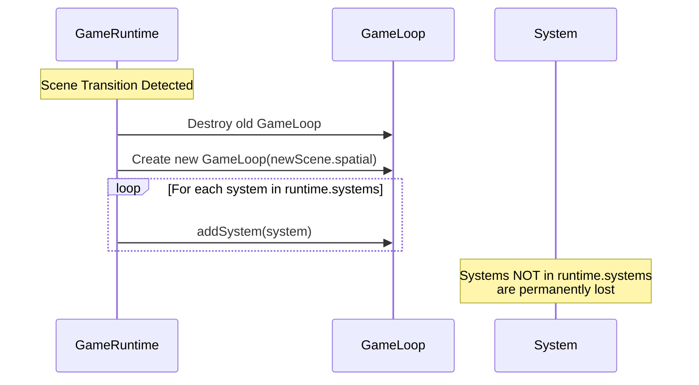

# System Registration Patterns

## Overview

GameSystems in Spartan must be registered correctly to persist across scene transitions. This document explains why the pattern exists and how to use it correctly.

## The Problem

When a scene transition occurs, GameRuntime recreates the GameLoop for the new scene's spatial system. During this recreation, **only systems in `runtime.systems[]` are re-registered**. Systems added directly via `gameLoop.addSystem()` are permanently lost.

## Why This Pattern Exists

### Architecture Constraint

Each GameLoop operates on exactly one SpatialSystem. When scenes change:

1. Old scene's spatial system is no longer active
2. New GameLoop must be created for new scene's spatial system
3. Systems need to be re-registered with the new GameLoop

### The Double-Registration Requirement

```
GameRuntime
├── systems: GameSystem[]        ← Persistent list (survives transitions)
└── gameLoop: GameLoop            ← Recreated on scene change
    └── systems: GameSystem[]     ← Ephemeral (lost on transition)
```

## Correct Registration Patterns

### Pattern 1: Via GameRuntime.new() (Recommended)

The safest approach is to pass systems during runtime creation:

```typescript
const runtime = GameRuntime.new({
  initialScene: { id: 'level1', width: 10, height: 10 },
  systems: [
    new TeleporterSystem(gameManager),
    new EnemyAISystem(gameManager)
  ],
  tickRate: 10
});
```

**Why this works:**
- Systems are stored in `runtime.systems[]`
- Automatically registered with initial GameLoop
- Automatically re-registered on scene transitions

### Pattern 2: Manual Double-Registration

When you need to add a system after runtime creation:

```typescript
const system = new MySystem(runtime.game);

// Step 1: Add to persistent systems array
(runtime as any).systems.push(system);

// Step 2: Add to current gameLoop
(runtime as any).gameLoop.addSystem(system);
```

**When to use:**
- Adding systems dynamically after runtime initialization
- Test scenarios requiring specific system setup
- Advanced runtime modifications

### Pattern 3: Via SceneLoader

When loading scenes from JSON configs:

```typescript
// In JSON config
{
  "scenes": [...],
  "systems": ["TeleporterSystem", "EnemyAISystem"]
}

// SceneLoader handles double-registration automatically
const loader = new SceneLoader();
const runtime = loader.load(config);
```

**How it works:**
```typescript
// Inside SceneLoader.load()
for (const systemName of config.systems) {
  const system = SYSTEM_REGISTRY[systemName](runtime.game);
  (runtime as any).systems.push(system);         // Persistent
  (runtime as any).gameLoop.addSystem(system);   // Current
}
```

## Wrong Patterns (Common Mistakes)

### ❌ Only Adding to GameLoop

```typescript
// WRONG: Lost on scene transition
gameLoop.addSystem(new MySystem());
```

**What happens:**
- System runs in current scene
- Scene transition destroys gameLoop
- System is gone forever

### ❌ Only Adding to Systems Array

```typescript
// WRONG: Not active until next transition
(runtime as any).systems.push(new MySystem());
```

**What happens:**
- System stored but not registered with current gameLoop
- Does nothing until a scene transition occurs
- Confusing behavior (appears broken initially)

### ❌ Accessing GameLoop Directly in Production

```typescript
// WRONG: Bypasses persistence mechanism
const loop = (runtime as any).gameLoop;
loop.addSystem(new MySystem());
```

**What happens:**
- Same as first mistake
- Also violates encapsulation

## Scene Transition Lifecycle



### Step-by-Step Flow

1. **Scene transition queued** (e.g., `gameManager.movePlayerToScene()`)
2. **Tick completes** - current systems finish execution
3. **Transition executes** - player moved between scenes
4. **GameRuntime.onSceneTransition() called**:
   ```typescript
   private onSceneTransition(newScene: Scene): void {
     // Recreate game loop for new scene
     this.gameLoop = new GameLoop(newScene.spatial);
     this.registerSystems(); // Re-registers from this.systems[]
   }
   ```
5. **New GameLoop created** for new scene's spatial system
6. **Systems re-registered** from `runtime.systems[]`
7. **Next tick runs** with new GameLoop

## Test Helper Function

For tests requiring system registration, use the helper:

```typescript
import { createRuntimeWithSystems } from './test-helpers';

const runtime = createRuntimeWithSystems({
  initialScene: { id: 'test', width: 10, height: 10 },
  systems: [new TeleporterSystem(gameManager)],
  tickRate: 10
});
```

**Benefits:**
- Encapsulates double-registration pattern
- Less boilerplate in tests
- Prevents registration mistakes
- Self-documenting intent

## Debugging Registration Issues

### Symptom: System works, then stops after scene transition

**Cause:** System only registered with gameLoop, not systems array

**Fix:** Use Pattern 1 or Pattern 2 from above

### Symptom: System doesn't run at all initially

**Cause:** System only in systems array, not registered with current gameLoop

**Fix:** Add `gameLoop.addSystem()` call

### Symptom: System runs multiple times per tick

**Cause:** System registered multiple times (both arrays and loop)

**Fix:** Only register once through proper pattern

## Best Practices

1. **Prefer Pattern 1** - Pass systems to `GameRuntime.new()`
2. **Use test helper** - Don't duplicate registration logic
3. **Document custom patterns** - If you deviate, explain why
4. **Avoid gameLoop access** - Use runtime-level APIs when possible
5. **Test scene transitions** - Include multi-scene tests when using systems

## Related Documentation

- `specs/spartan-responsibilities.md` - Architecture overview
- `packages/spartan/game-runtime.ts` - GameRuntime implementation
- `packages/spartan/game-loop.ts` - GameLoop implementation
- `packages/spartan/test/teleporter-roundtrip.test.ts` - Example usage

## Summary

**The Rule:** Systems must be in both `runtime.systems[]` AND the current `gameLoop` to work correctly across scene transitions.

**The Why:** GameLoop is recreated on scene transitions and only re-registers systems from the persistent `runtime.systems[]` array.

**The How:** Use Pattern 1 (recommended), Pattern 2 (when needed), or Pattern 3 (JSON configs).
