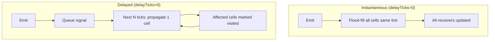
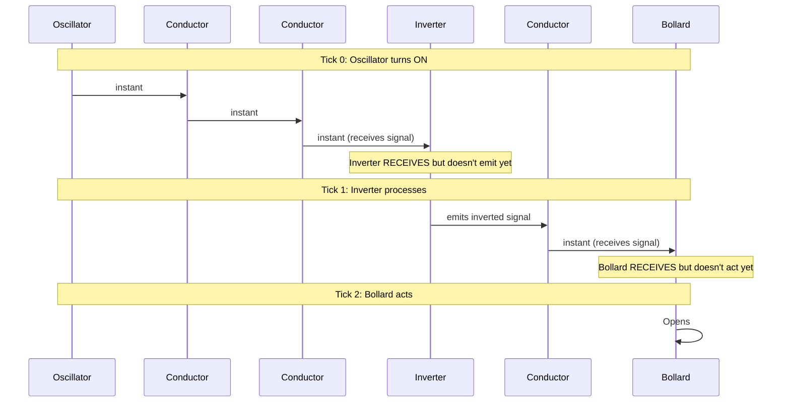
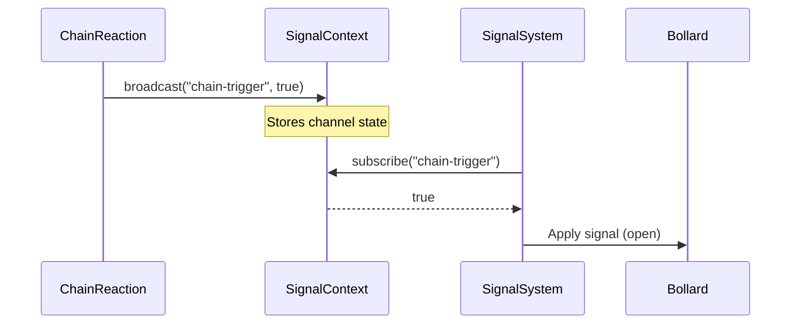

# Unified Signal Architecture Specification

## Overview

This specification proposes a **first-class Signal abstraction** that unifies propagation systems under a common protocol, enabling cross-system compatibility, delayed propagation, and guaranteed single-cell-per-tick semantics.

**Status**: Proposed  
**Date**: 2026-02-01

## Problem Analysis

### Current System Landscape

The codebase has four propagation systems with similar but isolated implementations:

| System | Base Class | Propagation Model | State Storage |
|--------|------------|-------------------|---------------|
| SignalSystem | BaseReactiveSystem | Instantaneous flood-fill | `currentTickSignals` Set |
| ChainReactionSystem | BaseTickedSystem | Ticked entity spawn | `spreadState`, `propagatedEntities` Maps |
| FireSystem | BaseTickedSystem | Ticked neighbor heating | `burningEntities` Map |
| LiquidSystem | BaseTickedSystem | Ticked depth transfer | `spreadState`, `propagatedEntities` Maps |

### Common Patterns Observed

All systems share:
1. **4-directional propagation** via `Direction.UP/DOWN/LEFT/RIGHT`
2. **State tracking** for entities being processed (`Map<entityId, state>`)
3. **Two-phase updates**: Calculate changes, then apply (prevents order bias)
4. **Layer-aware queries** checking multiple layers per cell
5. **Distance/lifetime limits** on propagation

### Problems with Current Approach

1. **Code duplication**: Similar flood-fill/spread logic in each system
2. **No cross-system interaction**: Fire can't trigger signals, signals can't trigger chains
3. **Inconsistent timing models**: No way to delay instantaneous signals
4. **No visit tracking**: Signal flood-fill recalculates every tick

---

## Proposed Architecture

### Option Analysis

| Approach | Pros | Cons |
|----------|------|------|
| **A. Mixin-based** | Composable, low coupling | TypeScript mixin complexity, no shared state |
| **B. Base class** | Shared infrastructure, clear hierarchy | Tight coupling, inheritance inflexibility |
| **C. Protocol + Context** | Decoupled, event-driven | Higher abstraction, more indirection |

**Recommendation**: **Option C (Protocol + Context)** with a new `SignalContext` injected into `GameContext`.

### Core Concept: SignalContext

A centralized signal broker that systems can publish to and subscribe from:

```typescript
interface SignalContext {
  // Broadcast a signal value to a channel
  broadcast(channel: string, value: boolean, source?: SignalSource): void;
  
  // Subscribe to a channel (returns current value)
  subscribe(channel: string): boolean;
  
  // Delayed propagation: queue a signal for future ticks
  queueSignal(channel: string, value: boolean, delayTicks: number): void;
  
  // Mark a cell as visited this tick (for flood-fill optimization)
  markVisited(x: number, y: number, signalId: string): boolean; // returns false if already visited
  
  // Reset per-tick state
  resetTickState(): void;
}
```

### SignalSource: First-Class Signal Identity

```typescript
interface SignalSource {
  /** Unique signal identifier for visit tracking */
  signalId: string;
  
  /** Origin coordinates for distance calculation */
  originX: number;
  originY: number;
  
  /** Current propagation distance from origin */
  distance: number;
  
  /** Maximum propagation distance (undefined = unlimited) */
  maxDistance?: number;
  
  /** Propagation delay in ticks (0 = instantaneous) */
  delayTicks: number;
  
  /** Tick when this signal was emitted */
  emitTick: number;
}
```

### Propagation Modes



---

## Propagation Timing Model

> [!IMPORTANT]
> **Core Design Principle**: Conductors propagate instantly. All active components introduce a 1-tick delay.

### Entity Classification

| Category | Entities | Timing | Mental Model |
|----------|----------|--------|--------------|
| **Conductor** | Conductive Floor | Instant | Wire (zero resistance) |
| **Active Component** | Inverter, Transceiver, AND/OR gates | 1-tick delay | Logic gate (processing time) |
| **Receiver** | Bollard, NPC wake, camera disable | 1-tick delay | Actuator (mechanical delay) |
| **Source** | Oscillator, Pressure Switch | Instant emit | Signal generator |

### Timing Behavior



### Cascading Bollard Example

A row of bollards connected through transceivers:

```
Tick 0:  [OSC ON] → [COND] → [TX-A receives]
Tick 1:                      [TX-A emits] → [TX-B receives]
Tick 2:                                      [TX-B emits] → [BOL-1 receives]
Tick 3:                                                      [BOL-1 opens] → [BOL-2 receives via chain]
Tick 4:                                                                      [BOL-2 opens]
...
```

Result: **Dramatic wave of bollards opening one-by-one** 🎬

### Synchronous Alternative

For simultaneous action, designers use **conductors on AI layer**:

```
[OSC] → [COND] → [COND] → [BOL-1]
                    ↓
                 [COND] → [BOL-2]
                    ↓
                 [COND] → [BOL-3]

Tick 0: All bollards receive signal same tick
Tick 1: All bollards open simultaneously
```

### Implementation Notes

```typescript
// Component types with processing delay
const DELAYED_COMPONENTS = ['inverter', 'transceiver', 'and-gate', 'or-gate'];
const DELAYED_RECEIVERS = ['bollard', 'camera', 'npc-wake'];

// During flood-fill
function markCellAsPowered(entityId, data, fromDir, updateLatches) {
  if (hasConductive(data)) {
    // Conductors: Mark powered immediately, signal passes through
    this.currentTickSignals.add(entityId);
  } else if (hasSignalReceiver(data)) {
    // Active components/receivers: Mark as "pending" for next tick
    this.pendingNextTick.add(entityId);
  }
}

// At start of next tick
function processPendingSignals() {
  for (const id of this.pendingNextTick) {
    this.currentTickSignals.add(id);
  }
  this.pendingNextTick.clear();
}
```

---

## Single-Visit Guarantee

### Problem

Signal systems need to ensure each cell is affected only once per signal wave.

### Solution: Visit Set per Signal ID

```typescript
class SignalContextImpl implements SignalContext {
  // Map<signalId, Set<"x,y">>
  private visitedThisTick = new Map<string, Set<string>>();
  
  markVisited(x: number, y: number, signalId: string): boolean {
    const key = `${x},${y}`;
    let visited = this.visitedThisTick.get(signalId);
    if (!visited) {
      visited = new Set();
      this.visitedThisTick.set(signalId, visited);
    }
    if (visited.has(key)) return false;
    visited.add(key);
    return true;
  }
  
  resetTickState(): void {
    this.visitedThisTick.clear();
  }
}
```

### Delayed Signal Queue

```typescript
interface QueuedSignal {
  channel: string;
  value: boolean;
  source: SignalSource;
  targetTick: number;
}

class SignalContextImpl {
  private signalQueue: QueuedSignal[] = [];
  
  queueSignal(channel: string, value: boolean, delayTicks: number): void {
    this.signalQueue.push({
      channel,
      value,
      source: { /* ... */ },
      targetTick: this.currentTick + delayTicks
    });
  }
  
  processQueue(currentTick: number): void {
    const ready = this.signalQueue.filter(s => s.targetTick <= currentTick);
    this.signalQueue = this.signalQueue.filter(s => s.targetTick > currentTick);
    
    for (const signal of ready) {
      this.broadcast(signal.channel, signal.value, signal.source);
    }
  }
}
```

---

## Integration with Existing Systems

### SignalSystem Enhancement

```typescript
class SignalSystem extends BaseReactiveSystem {
  update(context: GameContext): void {
    // Process queued delayed signals
    context.signals.processQueue(this.currentTick);
    
    // ... existing phases ...
    
    // Phase 2: Flood-fill with visit tracking
    this.floodFill(context, sources, (x, y) => {
      // Only process if not already visited by this signal
      return context.signals.markVisited(x, y, 'circuit-primary');
    });
  }
}
```

### ChainReaction as Signal Emitter

```typescript
class ChainReactionSystem extends BaseTickedSystem {
  protected onTick(context: GameContext): void {
    // ... spreading logic ...
    
    // When chain reaches a signal-compatible entity, emit
    if (targetData && hasSignalReceiver(targetData)) {
      context.signals.broadcast('chain-trigger', true, {
        signalId: `chain-${sourceId}`,
        delayTicks: 0, // Immediate
        // ...
      });
    }
  }
}
```

### Cross-System Triggers



---

## Trait Design: HasSignalCompatible

A unifying trait for any entity that can participate in signal networks:

```typescript
/**
 * HasSignalCompatible - Entity can send or receive channel-based signals.
 * 
 * This is the base trait for cross-system signal compatibility.
 * More specific traits (HasSignalEmitter, HasSignalReceiver) compose with this.
 */
export interface HasSignalCompatible {
  /** Channel(s) this entity listens to or broadcasts on */
  signalChannels: string[];
  
  /** Current signal state (per-channel) */
  signalStates: Record<string, boolean>;
}

/**
 * HasDelayedSignal - Entity emits signals with propagation delay.
 */
export interface HasDelayedSignal extends HasSignalCompatible {
  /** Ticks to delay signal propagation per cell */
  signalDelayTicks: number;
  
  /** Maximum signal propagation distance */
  signalMaxDistance?: number;
}
```

---

## Base System Option: BasePropagatingSystem

If mixin complexity is undesirable, an alternative base class:

```typescript
/**
 * BasePropagatingSystem - For systems that propagate effects through space.
 * 
 * Provides:
 * - Ticked execution
 * - Visit tracking per propagation wave
 * - Two-phase update (calculate then apply)
 * - 4-directional neighbor iteration
 */
export abstract class BasePropagatingSystem extends BaseTickedSystem {
  protected visitedThisTick = new Set<string>();
  
  protected markVisited(x: number, y: number): boolean {
    const key = `${x},${y}`;
    if (this.visitedThisTick.has(key)) return false;
    this.visitedThisTick.add(key);
    return true;
  }
  
  protected forEachNeighbor(
    cell: LinkedCell,
    callback: (neighbor: LinkedCell, direction: Direction) => void
  ): void {
    for (const dir of [Direction.UP, Direction.DOWN, Direction.LEFT, Direction.RIGHT]) {
      const neighbor = cell.neighbor(dir);
      if (neighbor) callback(neighbor, dir);
    }
  }
  
  protected onTick(context: GameContext): void {
    this.visitedThisTick.clear();
    this.propagate(context);
  }
  
  protected abstract propagate(context: GameContext): void;
}
```

---

## Recommended Approach

Given that **none of the signal system work is in production**, I recommend:

### Phase 1: SignalContext Protocol

1. Add `SignalContext` to `GameContext` interface
2. Implement `SignalContextImpl` with channel state, visit tracking, and delayed queue
3. Refactor `SignalSystem` to use `SignalContext` for visit tracking

### Phase 2: Cross-System Hooks

1. Add signal emission hooks to `ChainReactionSystem`
2. Add signal emission hooks to `FireSystem` (fire → signal trigger)
3. Define channel naming conventions

### Phase 3: Delayed Signal Entities

1. Add `HasDelayedSignal` trait
2. Create delayed transceiver variant
3. Implement wave-front propagation using queued signals

---

## Delayed Signal Example: Domino-Style Transceiver

```typescript
// Transceiver that propagates signal with 5-tick delay per cell
export type DelayedTransceiverData = TransceiverData & HasDelayedSignal & {
  type: 'delayed-transceiver';
  signalDelayTicks: 5;
  signalMaxDistance: 20;
};

// System handles delayed propagation
class SignalSystem {
  private resolveDelayedTransceivers(context: GameContext): void {
    for (const [entityId, pos] of context.spatial.getAllPositions()) {
      const data = context.spatial.getEntityData(entityId);
      if (data?.type !== 'delayed-transceiver') continue;
      
      // Only propagate if signal changed and not yet queued
      if (this.shouldPropagate(entityId, data)) {
        context.signals.queueSignal(
          data.channel,
          data.signalState,
          (data as DelayedTransceiverData).signalDelayTicks
        );
      }
    }
  }
}
```

---

## Files to Create/Modify

### New Files

| File | Purpose |
|------|---------|
| `core/signal-context.ts` | SignalContext interface and implementation |
| `traits/signal-compatible.trait.ts` | HasSignalCompatible, HasDelayedSignal traits |

### Modified Files

| File | Changes |
|------|---------|
| `core/types.ts` | Add `signals: SignalContext` to `GameContext` |
| `systems/signal.system.ts` | Use SignalContext for visit tracking |
| `systems/chain-reaction.system.ts` | Add signal emission hooks |
| `traits/signal.trait.ts` | Extend with channel support |

---

## Open Questions

1. **Channel vs Flood-fill**: Should wireless channels replace or coexist with wired flood-fill?
2. **Signal priority**: If multiple signals arrive same tick, which wins?
3. **Persistence**: Should SignalContext state persist across scene transitions?
4. **Debugging**: How to visualize signal flow for level designers?

---

## Summary

| Current State | Proposed State |
|---------------|----------------|
| 4 isolated propagation systems | Unified SignalContext protocol |
| No cross-system triggers | Channel-based event broadcasting |
| No delayed signals | Queue-based delayed propagation |
| Recalculates every tick | Visit set prevents re-processing |
| No shared abstraction | SignalContext + optional BasePropagatingSystem |

---

**Version**: 1.0 (Proposed)  
**Last Updated**: 2026-02-01  
**Implementation Status**: Specification Complete
